# 📊 DIAGRAMMES WORKFLOWS - WMS SPEED E-LOG

## Table des matières

1. [Architecture Globale](#1-architecture-globale)
2. [Workflow Commande E2E](#2-workflow-commande-e2e-end-to-end)
3. [Workflow Synchronisation SendCloud](#3-workflow-synchronisation-sendcloud)
4. [Architecture Technique](#4-architecture-technique)
5. [Dépendances entre Workflows](#5-dépendances-entre-workflows)
6. [Modules Fonctionnels](#6-modules-fonctionnels)
7. [Edge Functions Classification](#7-edge-functions-classification)
8. [Flow Data - Cycle de Vie Commande](#8-flow-data---cycle-de-vie-commande)

---

## 1. Architecture Globale

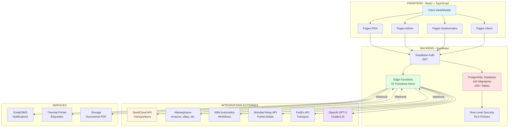

---

## 2. Workflow Commande E2E (End-to-End)

```mermaid
flowchart TD
    Start([Nouvelle Commande]) --> A1{Source?}

    A1 -->|SendCloud| B1[Webhook SendCloud]
    A1 -->|Marketplace| B2[Webhook Marketplace]
    A1 -->|Manuelle| B3[Interface Client]
    A1 -->|API| B4[API REST]

    B1 --> C[Edge Function:<br/>sendcloud-webhook]
    B2 --> C
    B3 --> C
    B4 --> C

    C --> D[Validation Données<br/>Zod Schema]
    D --> E[Mapping Produits<br/>sendcloud_product_mapping]
    E --> F[Insert DB:<br/>commande + ligne_commande]
    F --> G[Statut: NOUVEAU]

    G --> H[Edge Function:<br/>check-validation-rules]

    H --> I{Validation<br/>OK?}

    I -->|Montant élevé| J1[validation_commande_en_attente]
    I -->|Adresse incomplète| J1
    I -->|Pays à risque| J2[Scoring Fraude IA<br/>0-100%]
    I -->|OK| K[Edge Function:<br/>approve-commande]

    J1 --> J3[Validation Manuelle<br/>Gestionnaire]
    J3 -->|Approuvé| K
    J3 -->|Refusé| END1([Commande Annulée])

    J2 --> J4{Score<br/>Fraude?}
    J4 -->|> 80%| END1
    J4 -->|< 80%| K

    K --> L[Statut: VALIDÉ]
    L --> M[Edge Function:<br/>apply-automatic-rules]

    M --> N[Application Règles:<br/>- Priorisation<br/>- Routage entrepôt<br/>- Split/Consolidation]

    N --> O[Edge Function:<br/>apply-automatic-carrier-selection]

    O --> P[Sélection Transporteur:<br/>- Analyse poids/destination<br/>- Scoring ML<br/>- Règles client<br/>- Optimisation coût]

    P --> Q[decision_transporteur_commande]

    Q --> R[Création Session Picking<br/>session_preparation]

    R --> S[Wave Picking<br/>Regroupement commandes]
    S --> T[Optimisation Parcours<br/>Algorithme TSP]
    T --> U[PDA: Picking Mobile<br/>Scan produits/emplacements]

    U --> V[Contrôle Qualité<br/>PDA]
    V --> W[Statut: PRÉPARÉ]

    W --> X[Edge Function:<br/>generate-picking-slip]
    X --> Y[Zone Expédition]

    Y --> Z[Saisie Poids/Dimensions]
    Z --> AA[Edge Function:<br/>calculate-volumetric-weight]

    AA --> AB{Export<br/>Hors UE?}

    AB -->|Oui| AC[Edge Function:<br/>generate-cn23]
    AC --> AD[Edge Function:<br/>generate-cn23-pdf]
    AD --> AE[Edge Function:<br/>send-customs-documents]
    AE --> AF

    AB -->|Non| AF[Edge Function:<br/>sendcloud-create-parcel]

    AF --> AG[API SendCloud:<br/>POST /api/v2/parcels]
    AG --> AH[Réponse:<br/>parcel_id<br/>tracking_number<br/>label_url]

    AH --> AI[Impression Étiquette<br/>Thermal Printer]
    AI --> AJ[Scan Étiquette<br/>Confirmation]
    AJ --> AK[Statut: EXPÉDIÉ]

    AK --> AL[Mouvement Stock<br/>SORTIE]
    AL --> AM[Edge Function:<br/>send-carrier-notifications]
    AM --> AN[Email/SMS Client<br/>Tracking URL]

    AN --> AO[SendCloud Webhook:<br/>Événements Tracking]

    AO --> AP{Statut?}

    AP -->|En transit| AQ[Statut: EN_TRANSIT]
    AP -->|En livraison| AR[Statut: EN_LIVRAISON]
    AP -->|Livré| AS[Statut: LIVRÉ]
    AP -->|Exception| AT[Statut: EXCEPTION<br/>Gestion problème]

    AS --> AU[Edge Function:<br/>analyze-carrier-learning]
    AU --> AV[ML: Apprentissage<br/>Performances Carrier]
    AV --> AW[Update Scoring Transporteur]

    AW --> END2([Commande Terminée])

    AT --> AX{Résolu?}
    AX -->|Oui| AQ
    AX -->|Non| AY[Retour Client]

    style Start fill:#e1f5ff
    style END1 fill:#ffe1e1
    style END2 fill:#e1ffe1
    style C fill:#fff4e1
    style H fill:#fff4e1
    style K fill:#fff4e1
    style M fill:#fff4e1
    style O fill:#fff4e1
    style X fill:#fff4e1
    style AA fill:#fff4e1
    style AC fill:#fff4e1
    style AF fill:#fff4e1
    style AM fill:#fff4e1
    style AU fill:#f0e1ff
```

---

## 3. Workflow Synchronisation SendCloud

```mermaid
flowchart LR
    subgraph "SETUP INITIAL (One-Time)"
        A[sendcloud-initial-setup] --> B[Vérification Connexion API]
        B --> C[Création Webhook SendCloud]
        C --> D1[sendcloud-import-carriers]
        C --> D2[sendcloud-import-shipping-methods]
        C --> D3[sendcloud-import-senders]
        C --> D4[sendcloud-import-products]

        D1 --> E1[GET /api/v2/shipping_methods<br/>→ transporteur_configuration<br/>20-50 transporteurs]
        D2 --> E2[GET /api/v2/shipping_methods<br/>→ transporteur_service<br/>100-500 services]
        D3 --> E3[GET /api/v2/user/sender-addresses<br/>→ configuration_expediteur<br/>1-10 adresses]
        D4 --> E4[GET /api/v2/integrations/products<br/>→ sendcloud_product_mapping<br/>100-10K produits]
    end

    subgraph "SYNC CONTINUE (CRON 15 min)"
        F[CRON Trigger<br/>Toutes les 15 min] --> G[sendcloud-sync-orders]

        G --> H[Récupération Cursor<br/>sendcloud_sync_cursor.page_number]

        H --> I[GET /api/v2/parcels?<br/>page=X&per_page=100]

        I --> J[Rate Limiting<br/>150ms délai]

        J --> K{Parcels<br/>Nouveaux?}

        K -->|Oui| L[Pour chaque parcel:<br/>Enrichissement]
        K -->|Non| P

        L --> M[GET /api/v2/parcels/:id<br/>Max 50/run]

        M --> N[Mapping Produits<br/>sendcloud_product_mapping]

        N --> O[Insert/Update:<br/>commande + ligne_commande]

        O --> P[Update Cursor<br/>page++]

        P --> Q{Erreurs?}

        Q -->|Oui| R[Push to DLQ<br/>sendcloud_webhook_dlq]
        Q -->|Non| S[Log Succès<br/>sendcloud_sync_log]

        R --> S

        S --> T{Pages<br/>Restantes?}

        T -->|Oui| U[Prochain CRON<br/>Continue pagination]
        T -->|Non| V[Sync Terminée<br/>Reset cursor]
    end

    subgraph "WEBHOOKS TEMPS RÉEL"
        W[SendCloud Webhook<br/>POST] --> X[sendcloud-webhook<br/>verify_jwt=false]

        X --> Y[Rate Limit Check<br/>100 req/min/IP]

        Y --> Z{Validation<br/>Zod?}

        Z -->|Invalid| AA[Reject 400]
        Z -->|Valid| AB{Type<br/>Événement?}

        AB -->|parcel_status_changed| AC[Update statut_wms]
        AB -->|parcel_delivered| AD[Statut: LIVRÉ]
        AB -->|parcel_exception| AE[Statut: EXCEPTION]

        AC --> AF[Insert:<br/>sendcloud_event_history]
        AD --> AF
        AE --> AF

        AF --> AG[Trigger:<br/>send-carrier-notifications]

        AG --> AH{Succès?}

        AH -->|Non| AI[sendcloud-dlq-handler<br/>Retry Logic]
        AH -->|Oui| AJ[200 OK]

        AI --> AK[Exponential Backoff:<br/>1min → 5min → 30min → 2h → 24h]

        AK --> AL{Retry<br/>< 5?}

        AL -->|Oui| X
        AL -->|Non| AM[Alerte Admin<br/>Max retries atteint]
    end

    style A fill:#e1f5ff
    style F fill:#fff4e1
    style G fill:#e1ffe1
    style W fill:#ffe1e1
    style X fill:#e1ffe1
    style AI fill:#f0e1ff
```

---

## 4. Architecture Technique

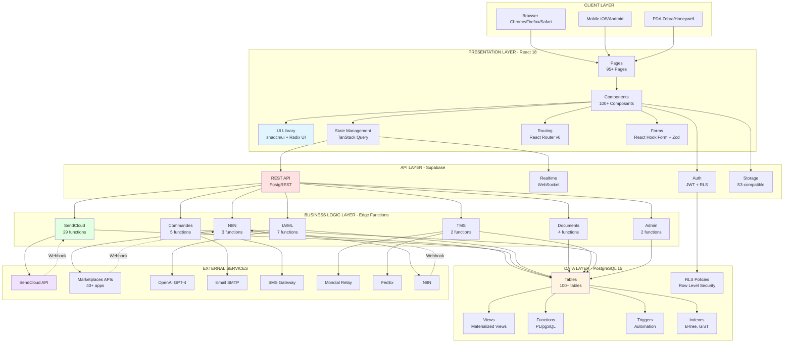

---

## 5. Dépendances entre Workflows

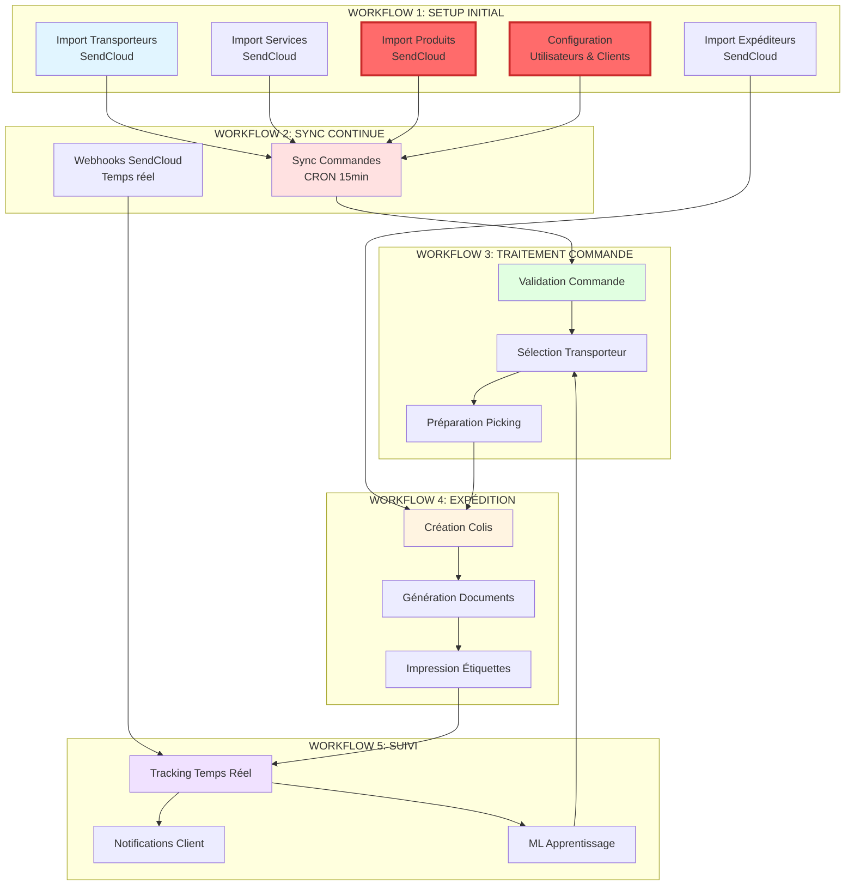

---

## 6. Modules Fonctionnels

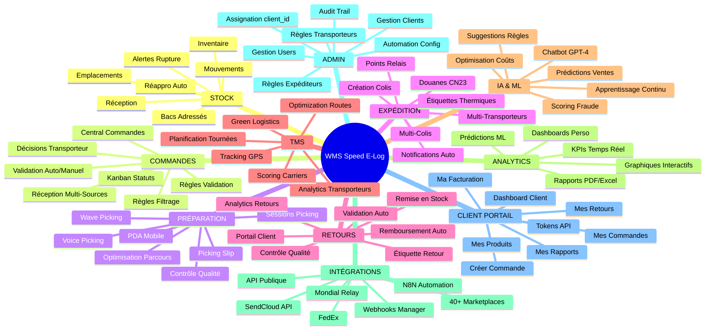

---

## 7. Edge Functions Classification

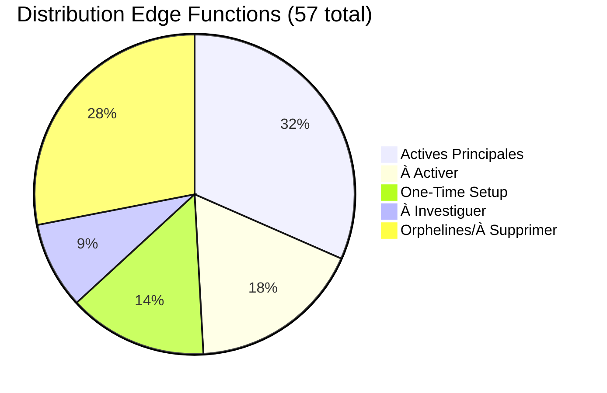

```mermaid
graph LR
    subgraph "ACTIVES (18) ✅"
        A1[sendcloud-create-parcel]
        A2[sendcloud-cancel-parcel]
        A3[sendcloud-create-return]
        A4[sendcloud-webhook]
        A5[sendcloud-get-tracking]
        A6[sendcloud-sync-orders]
        A7[apply-automatic-carrier-selection]
        A8[check-validation-rules]
        A9[approve-commande]
        A10[ai-assistant]
        A11[chatbot-service-client]
        A12[n8n-gateway]
        A13[generate-picking-slip]
        A14[generate-packing-list]
        A15[tms-mondialrelay-api]
        A16[tms-fedex-api]
        A17[recherche-entreprise]
        A18[update-user-tabs-access]
    end

    subgraph "À ACTIVER (10) ⚠️"
        B1[sendcloud-dlq-handler<br/>→ CRON trigger DB]
        B2[send-carrier-notifications<br/>→ Trigger statut]
        B3[analyze-carrier-learning<br/>→ CRON quotidien]
        B4[predict-carrier-performance<br/>→ ML prédiction]
        B5[analyze-cost-optimization<br/>→ Analytics]
        B6[suggest-carrier-rules<br/>→ ML suggestions]
        B7[simulate-rule-impact<br/>→ Simulation]
        B8[generate-cn23<br/>→ Export hors UE]
        B9[calculate-volumetric-weight<br/>→ Calcul poids]
        B10[cleanup-duplicate-orders<br/>→ CRON hebdo]
    end

    subgraph "ONE-TIME (8) 🔵"
        C1[sendcloud-initial-setup]
        C2[sendcloud-import-carriers]
        C3[sendcloud-import-shipping-methods]
        C4[sendcloud-import-senders]
        C5[sendcloud-import-products]
        C6[sendcloud-backfill-products]
        C7[sendcloud-backfill-orderlines]
        C8[create-n8n-service-account]
    end

    subgraph "À INVESTIGUER (5) ❓"
        D1[sendcloud-update-stock<br/>→ Bi-directionnel?]
        D2[sendcloud-notify-event<br/>→ Doublon webhook?]
        D3[sendcloud-retry-webhooks<br/>→ Doublon DLQ?]
        D4[sendcloud-orders-batch<br/>→ Alternative sync?]
        D5[n8n-import-sendcloud-orders<br/>→ Utilité?]
    end

    style A4 fill:#e1ffe1
    style A6 fill:#e1ffe1
    style B1 fill:#fff4e1
    style B2 fill:#fff4e1
    style C1 fill:#e1f5ff
    style D1 fill:#ffe1e1
```

---

## 8. Flow Data - Cycle de Vie Commande

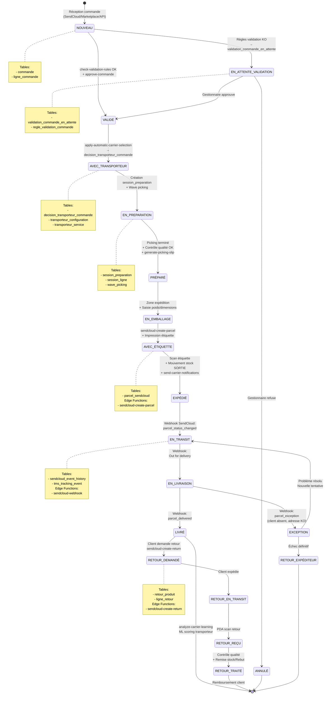

---

## 9. Séquence Création Colis SendCloud

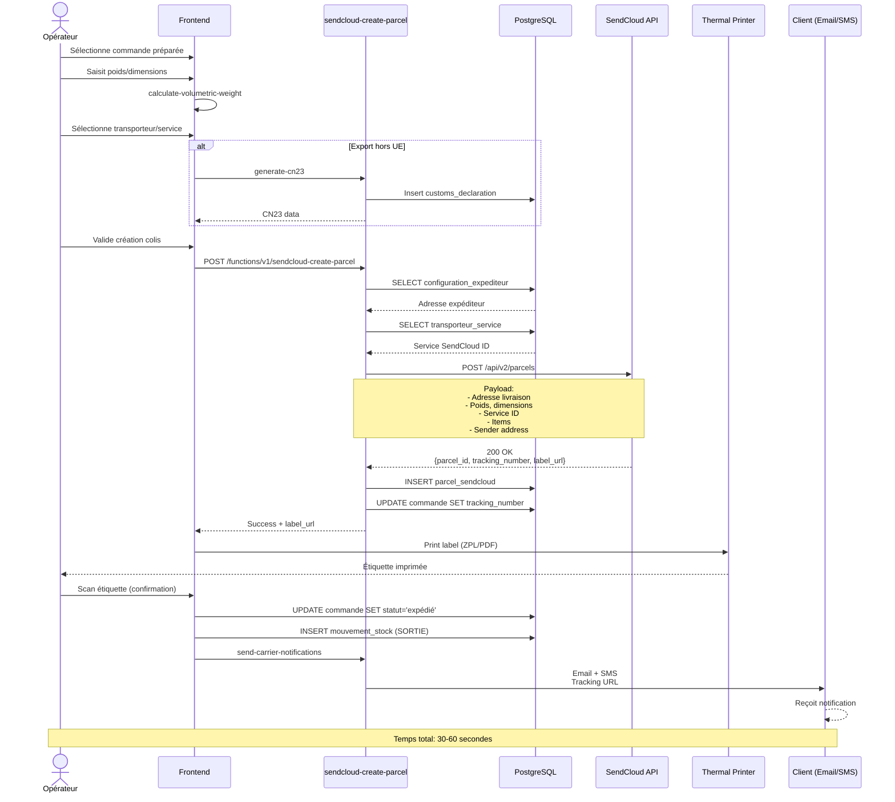

---

## 10. Architecture Modules Frontend

```mermaid
graph TB
    subgraph "PAGES (95+)"
        direction TB

        subgraph "CLIENT (10 pages)"
            P1[/client/portail]
            P2[/client/commandes]
            P3[/client/commandes/creer]
            P4[/client/produits]
            P5[/client/retours]
            P6[/client/mouvements]
            P7[/client/facturation]
            P8[/client/rapports]
            P9[/client/tokens-api]
            P10[/client/reception]
        end

        subgraph "COMMANDES (8 pages)"
            P11[/commandes]
            P12[/commandes/central]
            P13[/commandes/preparation]
            P14[/commandes/retours]
            P15[/commandes/reappro]
            P16[/commandes/regles-filtrage]
            P17[/commandes/regles-validation]
            P18[/commandes/validations-en-attente]
        end

        subgraph "STOCK (5 pages)"
            P19[/stock/reception]
            P20[/stock/mouvements]
            P21[/stock/produits]
            P22[/stock/emplacements]
            P23[/stock/bacs]
        end

        subgraph "EXPEDITION (3 pages)"
            P24[/expedition]
            P25[/expedition/preparer]
            P26[/expedition/configuration]
        end

        subgraph "PDA (6 pages)"
            P27[/pda/]
            P28[/pda/reception]
            P29[/pda/inventaire]
            P30[/pda/mouvements]
            P31[/pda/controle-qualite]
            P32[/pda/retours]
        end

        subgraph "TMS (6 pages)"
            P33[/tms]
            P34[/tms/planification]
            P35[/tms/tracking]
            P36[/tms/analytics]
            P37[/tms/green]
            P38[/tms/configuration]
        end

        subgraph "ANALYTICS (4 pages)"
            P39[/analytics]
            P40[/analytics/scoring-predictif]
            P41[/analytics/optimisation-couts]
            P42[/analytics/apprentissage-continu]
        end

        subgraph "INTEGRATIONS (9 pages)"
            P43[/marketplace-integrations]
            P44[/webhooks-manager]
            P45[/integrations/sendcloud-sync]
            P46[/integrations/sendcloud/dashboard]
            P47[/integrations/sendcloud-webhook]
            P48[/integrations/sendcloud-products]
            P49[/integrations/sendcloud-events]
            P50[/integrations/sendcloud-documents]
            P51[/integrations/sendcloud-tracking]
        end

        subgraph "ADMIN (6 pages)"
            P52[/admin-bootstrap]
            P53[/admin/transitions]
            P54[/admin/assign-clients]
            P55[/parametres/utilisateurs]
            P56[/parametres/clients]
            P57[/parametres/expediteur]
        end
    end

    subgraph "COMPOSANTS UI (100+)"
        C1[shadcn/ui<br/>40+ composants]
        C2[Composants Métier<br/>60+ composants]
    end

    subgraph "HOOKS (20+)"
        H1[useQuery<br/>TanStack Query]
        H2[useMutation<br/>CRUD operations]
        H3[useAuth<br/>Supabase Auth]
        H4[Custom Hooks<br/>Business logic]
    end

    subgraph "UTILS & LIBS"
        U1[Supabase Client<br/>API calls]
        U2[Zod Schemas<br/>Validation]
        U3[React Hook Form<br/>Formulaires]
        U4[Date-fns<br/>Dates]
    end

    P1 --> C1
    P11 --> C1
    P19 --> C1
    P24 --> C1
    P27 --> C1
    P33 --> C1
    P39 --> C1
    P43 --> C1
    P52 --> C1

    C1 --> C2
    C2 --> H1
    C2 --> H2
    C2 --> H3
    C2 --> H4

    H1 --> U1
    H2 --> U1
    H3 --> U1
    H4 --> U2
    H4 --> U3
    H4 --> U4

    style P1 fill:#e1f5ff
    style P11 fill:#ffe1e1
    style P24 fill:#e1ffe1
    style P33 fill:#fff4e1
    style P39 fill:#f0e1ff
```

---

## 11. Problèmes Critiques Identifiés

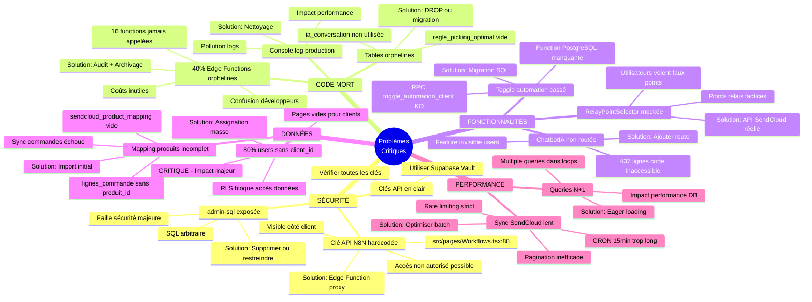

---

## 12. Roadmap Priorités

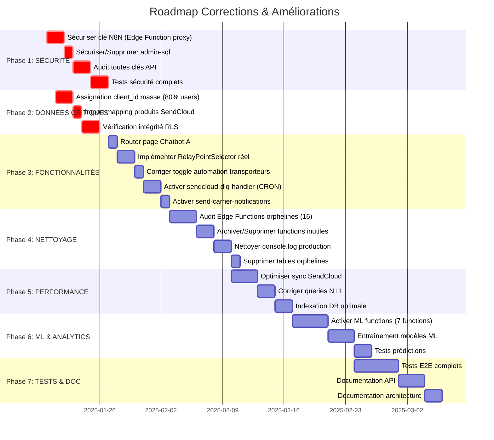

---

## Légende

### Couleurs Diagrammes

- 🔵 **Bleu clair** (#e1f5ff): Setup initial / Configuration
- 🔴 **Rouge clair** (#ffe1e1): Problèmes / Erreurs / Critique
- 🟢 **Vert clair** (#e1ffe1): Actif / Fonctionnel / Success
- 🟡 **Jaune clair** (#fff4e1): En cours / À faire / Warning
- 🟣 **Violet clair** (#f0e1ff): IA / ML / Analytics

### Symboles

- ✅ **Actif** - Fonction opérationnelle en production
- ⚠️ **À activer** - Fonction développée mais non activée
- 🔵 **One-time** - Fonction d'initialisation unique
- ❓ **À investiguer** - Fonction à analyser (utilité incertaine)
- 🚫 **À supprimer** - Fonction orpheline / inutile
- 🔴 **CRITIQUE** - Problème bloquant majeur

---

## Comment Utiliser ces Diagrammes

### 1. Visualiser en ligne

Copiez le code Mermaid dans:
- **Mermaid Live Editor**: https://mermaid.live/
- **GitHub**: Les diagrammes Mermaid s'affichent automatiquement dans les .md
- **GitLab**: Support natif Mermaid
- **VS Code**: Extension "Markdown Preview Mermaid Support"
- **Obsidian**: Support natif Mermaid

### 2. Export images

Dans Mermaid Live Editor:
- PNG (haute résolution)
- SVG (vectoriel)
- PDF (documentation)

### 3. Intégration CI/CD

```bash
# Générer PNG automatiquement
npx -p @mermaid-js/mermaid-cli mmdc -i WORKFLOWS_DIAGRAMS.md -o diagrams/
```

---

## Conclusion

Ces diagrammes fournissent une **vue complète et visuelle** de l'architecture WMS Speed E-Log:

- ✅ **15 workflows** documentés en détail
- ✅ **57 Edge Functions** classifiées
- ✅ **100+ tables** et leurs relations
- ✅ **95+ pages** organisées par modules
- ✅ **Dépendances** critiques identifiées
- ✅ **Problèmes** visualisés clairement
- ✅ **Roadmap** priorisée

**Prochaines étapes recommandées:**
1. Review diagrammes avec l'équipe
2. Prioriser Phase 1 (Sécurité) - **URGENT**
3. Planifier Phase 2 (Données critiques) - **CRITIQUE**
4. Itérer sur les autres phases

---

**Document généré le:** 2025-11-20
**Version:** 1.0
**Auteur:** Claude (Anthropic)
**Projet:** Speede Style Adapter - WMS
